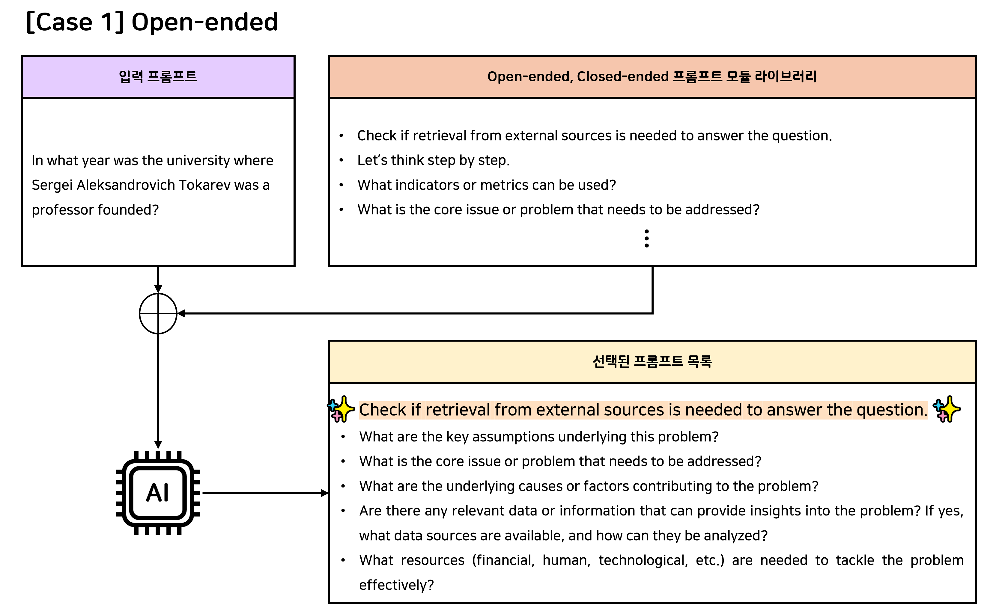
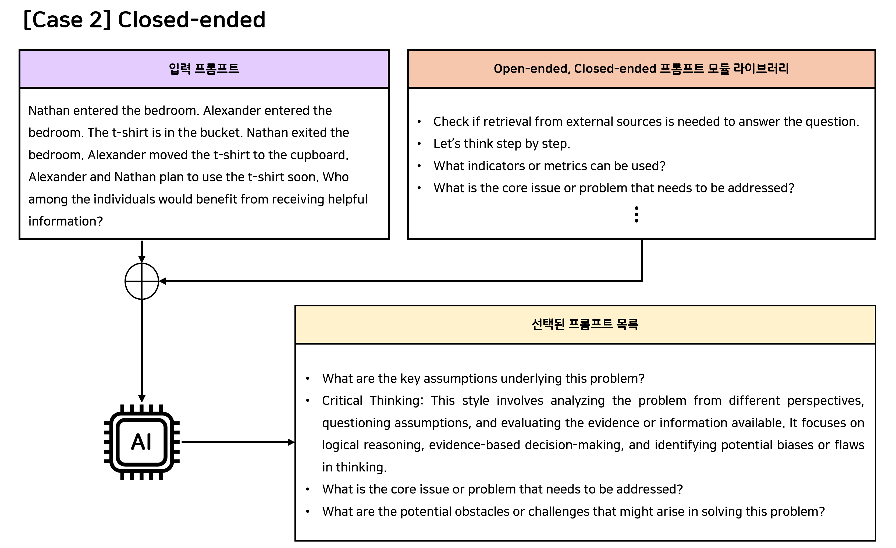

# AGI 발현을 위한 메타인지 프레임워크 핵심기술 개발 및 실증
## AGI 발현을 위한 Planner에 대한 연구 개발
### 입력 프롬프트를 최적으로 처리하기 위한 Open-ended, Closed-ended 프롬프트 모듈 라이브러리

### 💡 예시
- 외부 지식이 필요한 Open-ended 문제의 경우, RAG 기반 지식 보강 모듈과 함께 문제 해결에 필요한 프롬프트 모듈을 선택


- 내부 지식만으로 해결 가능한 Closed-ended 문제의 경우, RAG 모듈 없이 문제 해결에 필요한 프롬프트 모듈만 선택


## ⚙️ Requirements
```
pip install -r requirements.txt
```

## 💻 실행 방법
### Step 1. Dataset 준비
- 자세한 내용은 [README.md](data/README.md)를 참고해주세요.

### Step 2. 입력 프롬프트에 적합한 모듈 라이브러리 선택
```
python src/generation.py --dataset_name "dataset_name" --model_name "model_name"
```

### Reference
[Self-Discover: Large Language Models Self-Compose Reasoning Structures](https://proceedings.neurips.cc/paper_files/paper/2024/file/e41efb03e20ca3c231940a3c6917ef6f-Paper-Conference.pdf)
```
@inproceedings{NEURIPS2024_e41efb03,
 author = {Zhou, Pei and Pujara, Jay and Ren, Xiang and Chen, Xinyun and Cheng, Heng-Tze and Le, Quoc V. and H., Ed and Zhou, Denny and Mishra, Swaroop and Zheng, Huaixiu Steven},
 booktitle = {Advances in Neural Information Processing Systems},
 editor = {A. Globerson and L. Mackey and D. Belgrave and A. Fan and U. Paquet and J. Tomczak and C. Zhang},
 pages = {126032--126058},
 publisher = {Curran Associates, Inc.},
 title = {SELF-DISCOVER: Large Language Models Self-Compose Reasoning Structures},
 url = {https://proceedings.neurips.cc/paper_files/paper/2024/file/e41efb03e20ca3c231940a3c6917ef6f-Paper-Conference.pdf},
 volume = {37},
 year = {2024}
}
```
